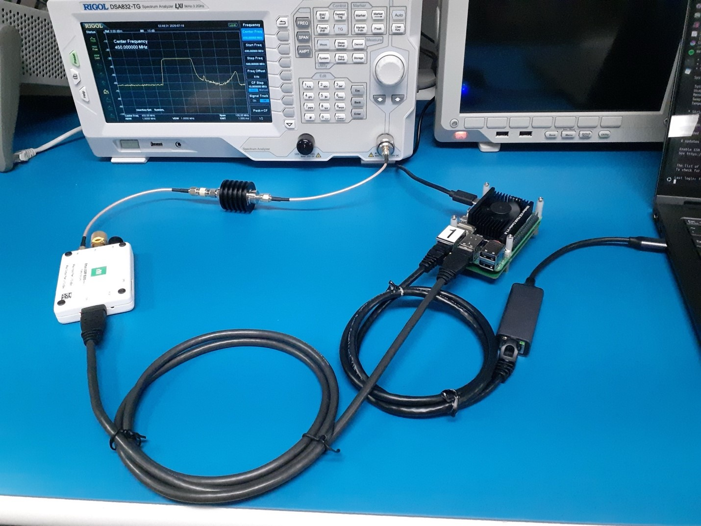
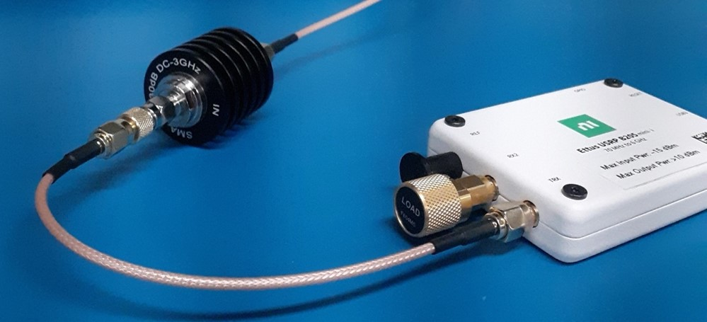
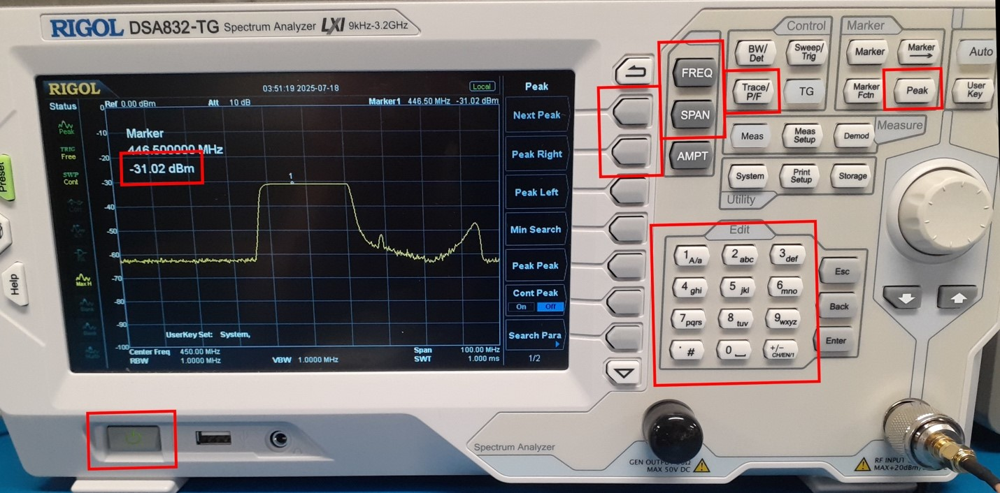
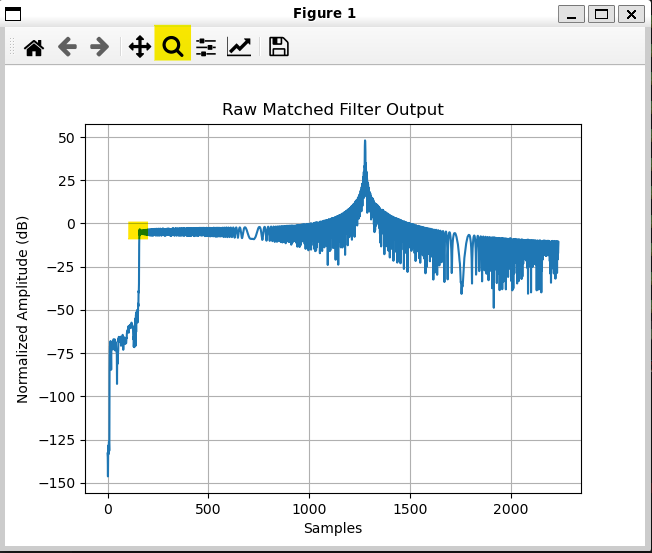
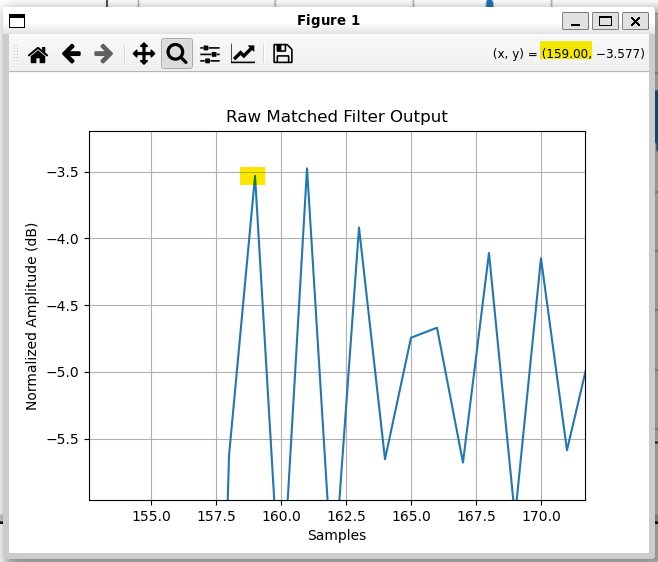
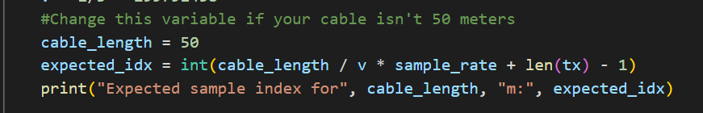
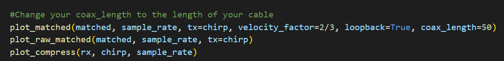
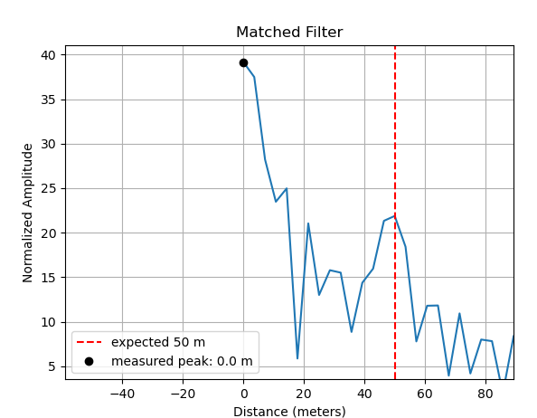
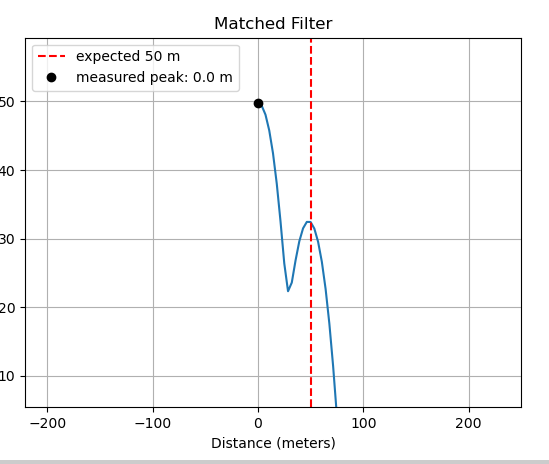

<link rel="stylesheet" href="../style.css">

## Indoor Testing

While indoors, make sure **not** to transmit any signals with the antenna. Only transmit into the spectrum analyzer or in a loopback configuration to the SDR. 

**Before doing any testing in a loopback configuration, use the spectrum analyzer to confirm that the transmitted power is less than the maximum input power the SDR can handle.** 

When connecting any SMA cable, make sure to hold the cable and connection point still while you connect it so that the cable **does not spin** as you tighten the nut, as this can cause damage to the pin. Tighten the nut using the SMA torque wrench (the wrench will bend when the proper tightness is reached). 

### Spectrum Analyzer Test

To test the program with the spectrum analyzer, you will need the following equipment: 
* b205mini SDR 
* USB 3.0 Micro B cable (connecting SDR to Pi) 
* Raspberry Pi 5 
* Raspberry Pi 5 Power Supply (USB C) 
* Ethernet cable (connecting Pi to Laptop) 
* Ethernet to USB C adapter (if your laptop doesn't have ethernet) 
* 30 dB inline attenuator 
* 2 SMA male-male cables 
* SMA female-female adapter (or replace one of the male-male cables with a male-female cable) 
* SMA torque wrench 
* SMA female to N-Type male adapter (probably plugged into the spectrum analyzer RF Input port already) 
* Spectrum Analyzer (Rigol DSA832-TG) 
* 50 Ohm Load (Found in the Calibration Kit F604MS) 

**Process**
1. Ensure the blue ESD mat is properly grounded, and there are no food or drinks nearby. 
2. Carefully take the 50 Ohm Load out of the calibration kit box. Be very careful while handling this piece of equipment.  
3. Connect 50 Ohm Load to the “RX2” port on the SDR, ensuring that the load does not spin while the nut is being tightened. Tighten it using the torque wrench. 
4. Connect this cable to the SMA female-female adapter. 
5. Connect the SMA female-female adapter to the “IN” port on the 30 dB attenuator. 
6. Connect the other SMA cable to the “OUT” port on the 30 dB attenuator.
  
7. Connect this SMA cable to the SMA female to N-Type adapter. 
8. Connect the SMA female to N-Type adapter to the “RF Input” port on the spectrum analyzer if it is not already connected. Take special care that the adapter does not spin while connecting it to this port. 
9. Turn on the spectrum analyzer.

10. Set the Spectrum Analyzer's frequency to the chirps' configured center frequency. 
11. Set the span of the spectrum analyzer to a bandwidth that allows you to see your full chirp in detail. 
12. Configure your spectrum analyzer to see the maximum value when sampled. 
13. Follow the steps in the sections above to connect your laptop to the Pi and get all the code ready to run on the Pi. 
14. Plug the USB 3.0 Micro B cable into one of the blue USB ports on the Pi and plug the other end into the SDR. 
15. Follow the Running the Code section below on how to run the program. 
16. When the code is running, you should see the transmissions appear on the spectrum analyzer. To see the peak transmitted power, press “Peak”. Ensure that this value is less than the SDR’s max input power before doing any loopback or outdoor testing. 
17. Since the SDR is not receiving any samples, you will see receiver errors printed to `uhd_stdout.log`, and `rx_samps.bin` will be empty.

### Loopback Test 

To get any actual data from the SDR, we must both transmit and receive signals by connecting the SDR to itself in a loopback configuration. 

**Before running the program in this configuration, make sure that you have tested your current code and config settings with the spectrum analyzer method above, and that the peak power is less than the SDR’s max input power (-15 dBm)!** 

**When connecting the b205mini to itself, you should always use a 30 dBm attenuator!**

1. Follow the steps in the Spectrum Analyzer section above to set up the hardware and test it with the spectrum analyzer. Confirm that the program works and the peak power is less than -15dBm. 
2. Stop all transmissions, and do not transmit again until everything has been reconnected. You can unplug the SDR from the Pi to ensure this cannot happen. 
3. Disconnect the SMA cable from the adapter on the spectrum analyzer. 
4. Carefully disconnect the 50 Ohm Load and place it back in the box. 
5. Connect the SMA cable to the “RX2” port on the SDR. 
6. Plug the SDR back into the Pi if you disconnected it previously. 
7. Follow the Running the Code section below to run the program.

## Running the Code: 
Now that you’re connected to the Pi and have hardware set up, you can run the code with the following commands: 

1. run `cd uhd_radar/` 
2. run `conda env create -n myenvironmentname -f environment.yaml` This makes your conda environment. `-n myenvironmentname` is optional, the default name specified in `environment.yaml` is `uhd`. If you are setting an environment up on a Raspberry Pi, we recommend using environment-rpi.yaml instead. This version includes additional dependencies used by manager/uav_payload_manager.py, a helper script designed to run only on Raspberry Pi-based radar instruments.
3. run `sudo apt install make` and `sudo apt install cmake` 
4. run `uhd_images_downloader`
5. run `conda activate uhd`
6. run `make hardware-test` and `make software-test` (if you made any changes to the default file, it will fail a software-test because it is looking for the default config settings)
7. Check your config settings are set correctly with `nano config/<your-file>.yaml` (you may want to make a copy of the default.yaml file with `cp filename-you're-copying name-of-new-file`) Read [here](/docs/radar/sdr-interface/config) to learn about configuration options.
    - If you are using the B205-mini, make sure the following values in `RF0` (not RF1) section are set: 
        - `tx_gain` should **not** exceed ~80 dB
        - `rx_gain` should **not** exceed 76 dB
        - `tx_ant` should be set to `"TX/RX"`
        - `rx_ant` should be set to `"RX2"`
        - `transmit` should be set to `True`
8. run `python run.py config/<your-file>.yaml` 
    - If you have `num_pulses` set to `-1`, then you must stop the program with `Ctrl+C`

{}
If you are going to be running a lot of different tests, you probably want to make a table to keep track of which saved file relates to what sort of test. 
{}

{}
If you see an error that says `L[1784219558.637]       [ERROR] (Chirp 3515) Receiver error: ERROR_CODE_LATE_COMMAND`, this is normal. The SDR will just retry sending a chirp since that chirp failed. The number of errors is also random. When you run the same config file sometimes you'll get more or less late errors.   
{}

{}
If you want more information on how the code works, check out the [Runtime Overview](/docs/radar/setupguide/5connectSDR/1codeoverview)
{}

### Plotting Data 
There are two main files you can run to plot your received data. You can run `test_loopback.py` (under `/test_scripts` in `/postprocessing`) or `plot_samples.py` . At the moment, `plot_samples.py` does not print the correct distance in the terminal and `test_loopback.py` may print the correct distance. It does not work for the author's setup but it may work for other setups. `test_loopback.py` graphs the matched filter version which will show peaks at the correct distance which makes it better than the `plot_samples.py` script. 

#### Running `test_loopback.py`
For the loopback test to work correctly, you will need to edit the `zero_sample_idx`, `cable_length`, and `coax_length` which are in the **`loopback_testing.py` file**. 

This is how to edit the `zero_sample_idx`. You need to first run the code so you can manually check what the zero sample is. 
1. To view the output data, transfer the desired data files to a laptop (typically the config.yaml and _rx_samps.bin file), ensure the `PLOT` section has been copied to the config file (it can be found in `synthetic-config.yaml`) and update the parameters in that section to match the names of the trial you wish to view. 
2. The zero sample index is easiest to see if you have the `rectangular` chirp window.
1. After running the loopback test with short SMA cables, scp the `_config.yaml` and `_rx_samps.bin` files from your Raspberry Pi onto your laptop. You want to save these in your branch/clone of the uhd_radar code under the data folder.
2. Open the WSL terminal (you can do this in VSCode, hit CTRL + `, and use the dropdown arrow to change the terminal type to WSL) 
3. Activate the conda environment with `conda activate environment-name`. You should already be in your uhd_radar folder but if not, `cd` into it
4. Run `python processing/test_scripts/test_loopback.py data/timestamp_config.yaml` where timestamp is edited to whatever config file you have saved in data. 
5. The first graph that appears is the chirp, you want to close this to allow the next graph to appear. The next graph will be matched filter, also close this.
6. Here is an example of what the graph will look like. You want to use the magnifying glass and zoom in on the sharp corner.  
 

7. When you hover your mouse over the first point, the x position will indicate what the `zero_sample_idx` is. 

8. You can now edit the variable in the `loopback_testing.py` file, NOT the `test_looback.py` file. It is in the definition of the `plot_matched` function. It is the last parameter that is defined, all the way to the right. 

The default length for the `cable_length` and `coax_length` is 50 m. If you aren't using a 50 m cable then you'll need to edit this value. If you are using short SMA cables, there is a chance the distance won't show up properly because the distance is so small. The units used for these variables are meters. 

1. Open the `loopback_testing.py` file
2. You can CTRL + F to find the `cable_length`. It will be beneath the `plot_matched` function definition. 

3. To change `coax_length`, this variable will be at the bottom of the same file in the `main` function. When `plot_matched` is called, `coax_length` is given a value of 50. Change this to however long the cable is.  

Now that all the variables are edited, you can run `test_loopback.py` and have accurate results.
1. Run `python processing/test_scripts/test_loopback.py data/timestamp_config.yaml` with timestamp edited to whatever config file you have saved in data.
2. After closing the first chirp file you will see the matched filter. After zooming in on the beginning of the graph, it might look something like this. You can see that there is a slight peak at 50 m. The peak at 0 is higher because the noise traveling directly from trasmit to receiver part is louder. Not sure if this is just an issue of my set up. 

3. It can be easier to see the peak using the "blackman" chirp window.

#### Running `plot_samples.py`

{}
rx_samps.bin is a binary file (.bin stands for binary), so if you try to open and read it in your powershell, it'll probably crash! But it does look cool to see a bunch of random symbols sprint past your screen. 
{}
 
1. To use `plot_samples.py`, run `python postprocessing/plot_samples.py data/<timestamp>_config.yaml`. If you run this in the Raspberry Pi terminal, no plots will show up because the terminal doesn't have the capability. It will print out a distance but at the moment I don't think it is working.
2. To get the plots to show up, you need to run the files on your laptop in the WSL (this was setup in the ORCA setup step).
3. You will need to SCP the `_config.yaml` and `_rx_samps.bin` files to your laptop and save them in the data file in your branch or clone of the code. It can be easier to just SCP them into your laptop's download folder and use file explorer to drag it into the proper folder. 
4. Open the WSL terminal (you can do this in VSCode, hit CTRL + `, and use the dropdown arrow to change the terminal type to WSL) 
3. Activate the conda environment with `conda activate environment-name`. You should already be in your uhd_radar folder but if not, `cd` into it
4. Run `python postprocessing/plot_samples.py data/<timestamp>_config.yaml`. All three graphs will show up at the same time. 

